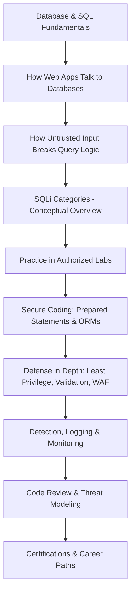

<div align="center">

# 🛡️ Awesome SQL Injection Defense

### A Complete, Ethical, Hands-On Curriculum for Understanding, Detecting, and Preventing SQL Injection

[](https://github.com/sindresorhus/awesome)
[](LICENSE)
[](CONTRIBUTING.md)
[](https://owasp.org/www-project-top-ten/)
[]()
[]()
[](https://github.com/AtiaAbk)

**A defensive-security-first repository for students, developers, and security learners.**
No attack tooling. No exploitation of real systems. Just deep understanding, secure coding, and detection.

[Roadmap](#-learning-roadmap) • [Repository Map](#-repository-map) • [Labs](#-practice-labs-legal-only) • [Cheat Sheets](#-cheat-sheets) • [Contributing](CONTRIBUTING.md)

**Maintained by [Atia Sanjida](https://github.com/AtiaAbk)**

</div>

---

## ⚖️ Ethics & Scope Statement

This repository exists to help people **understand SQL Injection well enough to stop it** — as developers, security engineers, QA testers, and defenders. It is built around the principle that the best defenders understand attacker logic conceptually, but that **understanding a vulnerability class is not the same as providing an attack manual.**

**This repository will always:**
- Focus on *concepts*, *detection*, *prevention*, and *secure coding*
- Point to **authorized, legal, purpose-built vulnerable labs** (OWASP Juice Shop, DVWA, WebGoat, PortSwigger Academy, etc.) for hands-on practice
- Explain *why* something is vulnerable and *how* to fix it — not step-by-step exploitation of arbitrary/unauthorized targets

**This repository will never:**
- Provide instructions for attacking systems you don't own or lack written authorization to test
- Host working exploit payloads targeted at production systems
- Encourage bypassing authentication or accessing data without permission

> Unauthorized access to computer systems is illegal in most jurisdictions (e.g., the U.S. Computer Fraud and Abuse Act, UK Computer Misuse Act). Always practice on systems you own or have explicit written permission to test.

---

## 📖 Project Description

SQL Injection (SQLi) has been on the OWASP Top 10 in some form for over two decades, and remains one of the most common — and most preventable — vulnerability classes in web applications. This repository is a structured, self-paced curriculum that takes a learner from "what is a database" to "I can review code, run a threat model, and design a secure data-access layer that is SQLi-resistant by construction."

It's built for self-learners, computer science students, junior developers, QA/test engineers, and anyone preparing for defensive security or AppSec-adjacent roles.

---

## 🎯 Learning Objectives

By completing this repository, you will be able to:

- [ ] Explain how relational databases process queries and why untrusted input can alter query logic
- [ ] Describe the major SQLi categories conceptually (in-band, blind, error-based, time-based, second-order) and why each is dangerous
- [ ] Identify SQLi-vulnerable patterns during code review
- [ ] Write secure, parameterized data-access code in at least 3 languages
- [ ] Configure database accounts following least-privilege principles
- [ ] Set up basic detection/logging/alerting for anomalous query patterns
- [ ] Use OWASP resources (ASVS, Testing Guide, Cheat Sheets) confidently
- [ ] Practice safely and legally using purpose-built vulnerable labs
- [ ] Understand the certification landscape for AppSec / offensive security career paths

---

## 👤 Who This Repository Is For

| Audience | Value |
|---|---|
| **Students** (CS, cybersecurity, bootcamp) | Structured roadmap + science-fair/coursework-ready reference material |
| **Junior developers** | Learn to write SQLi-proof code from day one |
| **QA / Test engineers** | Learn what to test for and how to write meaningful security test cases |
| **Aspiring AppSec / Pentest professionals** | Foundational conceptual knowledge before tackling OSCP-style offensive training |
| **Educators** | Ready-made curriculum and lab links for teaching secure coding |

---

## 📋 Prerequisites

- Basic SQL (`SELECT`, `INSERT`, `WHERE`, `JOIN`)
- Basic programming in at least one language (Python, Java, PHP, JS, C#, Go, or Rust)
- Basic command-line comfort
- A virtual machine or container tool (VirtualBox, Docker) for running labs locally
- **No prior security experience required**

---

## 🗺️ Learning Roadmap



Full breakdown: [`roadmap/ROADMAP.md`](roadmap/ROADMAP.md)

**Difficulty tiers:**

| Level | Focus | Est. Hours |
|---|---|---|
| 🟢 Beginner | DB fundamentals, how SQLi happens conceptually, first labs | 15–20h |
| 🟡 Intermediate | SQLi categories, secure coding in your primary language, code review | 20–30h |
| 🔴 Advanced | Multi-language secure coding, detection engineering, threat modeling, WAF tuning | 25–35h |

---

## 🗂️ Repository Map

```
awesome-sql-injection-defense/
├── README.md                     ← you are here
├── roadmap/
│   └── ROADMAP.md                ← full detailed learning path
├── labs/
│   └── README.md                 ← legal practice environments
├── cheat-sheets/
│   ├── sql-syntax.md
│   ├── secure-coding-checklist.md
│   ├── code-review-checklist.md
│   └── owasp-testing-checklist.md
├── secure-coding/
│   ├── python/  java/  php/  nodejs/  csharp/  go/  rust/
├── defensive-security/
│   └── DEFENSE-IN-DEPTH.md       ← prepared statements, WAF, monitoring, SDLC
├── database-comparison/
│   └── COMPARISON.md             ← MySQL vs PostgreSQL vs SQLite vs SQL Server vs Oracle vs MariaDB
├── resources/
│   ├── github-repositories.md
│   ├── books.md
│   ├── research-papers.md
│   ├── videos.md
│   └── certifications.md
├── PROGRESS-TRACKER.md
├── CONTRIBUTING.md
├── CODE_OF_CONDUCT.md
└── LICENSE
```

---

## ✅ Progress Checklist

- [ ] Complete Database & SQL Fundamentals
- [ ] Understand how SQLi occurs (conceptually)
- [ ] Complete OWASP Juice Shop SQLi-related challenges
- [ ] Complete DVWA SQLi module (low → high security settings)
- [ ] Complete relevant PortSwigger Academy labs
- [ ] Write secure code samples in 2+ languages
- [ ] Complete a code review exercise using the checklist
- [ ] Set up basic query logging/monitoring in a test project
- [ ] Read OWASP SQL Injection Prevention Cheat Sheet end-to-end
- [ ] Review certification options and pick a path

Track weekly/monthly pacing in [`PROGRESS-TRACKER.md`](PROGRESS-TRACKER.md).

---

## 🤝 Contributing

Contributions are welcome — especially defensive content, secure code examples, and links to legitimate learning resources. Please read [`CONTRIBUTING.md`](CONTRIBUTING.md) before opening a PR. All contributions must comply with the [Ethics & Scope Statement](#️-ethics--scope-statement) above.

## 📜 Code of Conduct

This project follows a [Code of Conduct](CODE_OF_CONDUCT.md). By participating, you agree to uphold it.

## 📄 License

Documentation is licensed under [CC BY-NC-SA 4.0](LICENSE). Code samples are licensed under MIT unless otherwise noted.

## 🙏 Acknowledgements

This repository builds on and points to the incredible work of the **OWASP Foundation**, **PortSwigger Web Security Academy**, **MITRE**, **NIST**, and the maintainers of DVWA, WebGoat, Juice Shop, and Mutillidae II. This project does not claim ownership of the third-party tools and labs it references — it links to them with credit.

---

<div align="center">

**⭐ If this repository helps your learning, consider starring it.**

---

### 👤 Author

**Atia Sanjida**  

[](https://github.com/AtiaAbk)
[](https://www.linkedin.com/in/atia-sanjida-085947233/)
[](mailto:atia.abk@gmail.com)

</div>
