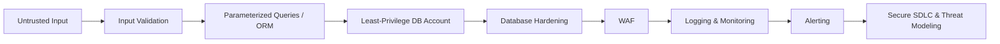

# 🛡️ Defense in Depth for SQL Injection

No single control is sufficient on its own. Layer these together.

## 1. Parameterized Queries / Prepared Statements
The primary, structural defense. The database driver keeps user data and SQL code separate at the protocol level, so input can never change query logic — regardless of what characters it contains. See [`secure-coding/`](../secure-coding/) for examples in 7 languages.

## 2. ORMs
Modern ORMs (SQLAlchemy, Hibernate, Eloquent, Entity Framework, GORM, Diesel, Sequelize/Prisma) parameterize queries by default. The risk reappears when developers drop into raw-query escape hatches — those must always still use bound parameters.

## 3. Input Validation
Allowlist expected formats (e.g., a username matching `^[a-zA-Z0-9_]{3,32}$`). This reduces attack surface and catches malformed input early, but it is **not a substitute** for parameterized queries — validation can be bypassed or incomplete, especially for free-text fields.

## 4. Least Privilege
- Give each service/application its own database account
- Grant only the permissions it needs (e.g., `SELECT` only for a read replica consumer)
- Never use admin/root/`sa` credentials for application traffic
- Separate schemas or databases by trust boundary where practical

## 5. Secrets Management
- Store credentials in a secrets manager (HashiCorp Vault, AWS Secrets Manager, Azure Key Vault, GCP Secret Manager)
- Rotate credentials regularly
- Never commit credentials to source control (use `.gitignore`, pre-commit secret scanners)

## 6. Database Hardening
- Disable unnecessary database features/extensions
- Restrict network access to the database (private subnets, security groups, firewall rules)
- Keep the database engine patched
- Disable verbose error messages in production

## 7. Web Application Firewall (WAF)
- Can catch known SQLi payload *patterns* as a compensating control
- **Not a substitute** for secure code — WAFs can be bypassed with encoding/obfuscation and produce false positives/negatives
- Useful for virtual patching while a real fix is deployed

## 8. Logging & Monitoring
- Log query patterns, especially from application service accounts
- Flag anomalies: unexpected `UNION`, unusual query length, high error rates from a single source, queries touching tables outside a service's normal scope
- Centralize logs (SIEM) for correlation across services

## 9. Alerting
- Set thresholds for repeated database errors from the same session/IP
- Alert on privilege escalation attempts or access to sensitive tables outside normal patterns

## 10. Secure SDLC & Threat Modeling
- Add SAST rules that flag dynamic SQL construction in CI
- Require security review for new raw-SQL code paths
- Apply lightweight STRIDE threat modeling to new data-access components during design, not after deployment
- Maintain a "definition of done" that includes: parameterized queries used, least-privilege account confirmed, tests added

---

## Quick Reference: What Each Layer Catches

| Layer | Catches | Doesn't Catch |
|---|---|---|
| Parameterized queries | Structural SQLi at the query level | Logic flaws unrelated to query construction |
| Input validation | Malformed/unexpected input | Well-formed but malicious input matching the allowlist |
| Least privilege | Blast radius of a successful injection | The injection itself |
| WAF | Known payload signatures | Novel encodings, business-logic abuse |
| Logging/monitoring | Post-hoc detection, forensics | Prevention (it's detective, not preventive) |
