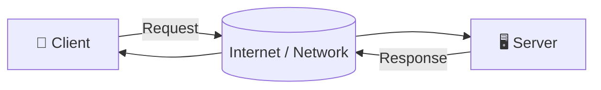
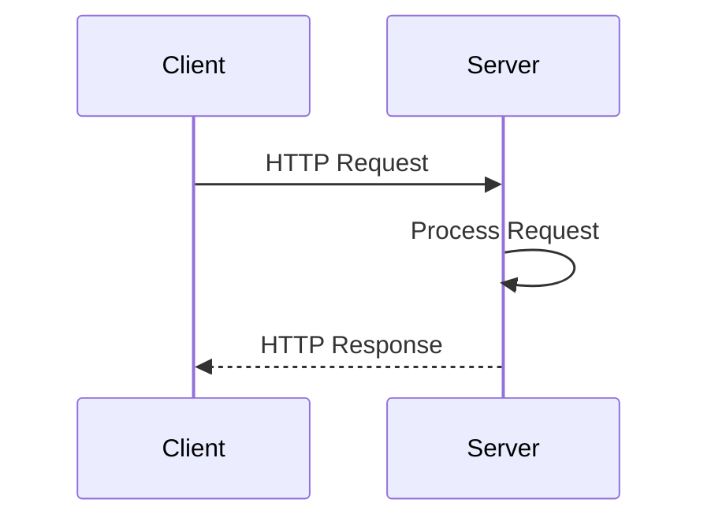
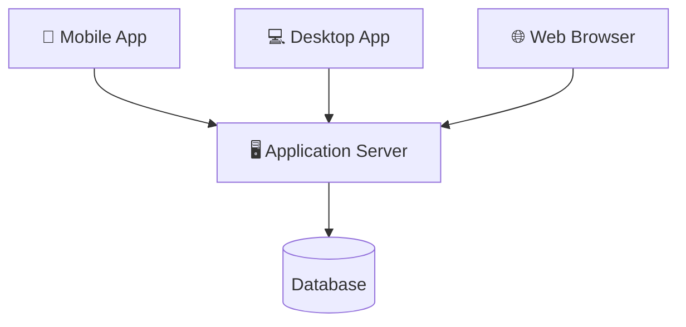
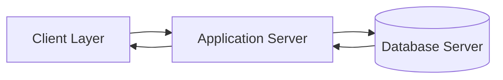
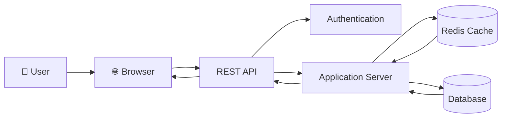

# SQL Injection Handbook
### A Beginner to Intermediate Guide for Ethical Learning

> Version: 1.0
>
> Author: AtiaAbk
>
> Status: Work in Progress

---

# Disclaimer

This repository is created **only for educational and defensive security purposes**.

All demonstrations should be performed only on:

- Your own applications
- Intentionally vulnerable labs
- CTF challenges
- Systems where you have explicit written permission

Never test real websites without authorization.

---

# Table of Contents

1. Introduction
2. What is SQL?
3. What is a Database?
4. What is DBMS?
5. Client-Server Architecture
6. HTTP & HTTPS
7. URL & URI
8. GET vs POST
9. Request & Response
10. Cookies & Sessions
11. Web Application Flow
12. Database Fundamentals
13. SQL Basics
14. SQL Injection (Concept)
15. Why SQL Injection Happens
16. Prevention Techniques
17. Practice Labs
18. Resources
19. Glossary

---

# Introduction

SQL Injection is one of the most well-known web application security issues.

Understanding how SQL Injection occurs helps developers build secure applications and helps security professionals identify and prevent vulnerabilities during authorized security assessments.

This handbook focuses on understanding concepts, web technologies, databases, and secure coding practices using legal practice environments.

---


---

# What is SQL?

SQL stands for

Structured Query Language

It is the standard language used to communicate with relational databases.

SQL allows applications to:

- Store data
- Retrieve data
- Update data
- Delete data
- Manage databases

---

# What is a Database?

A database is an organized collection of information.

Example:
| ID | Name  | Department |
| -- | ----- | ---------- |
| 1  | Alice | CSE        |
| 2  | Bob   | ICE        |
| 3  | Carol | EEE        |

Think of a database as a digital filing cabinet.

---


Think of a database as a digital filing cabinet.

---

# What is DBMS?

DBMS = Database Management System

It is software used to create, manage, and maintain databases.

Popular DBMS:

| Database | Company |
|------------|---------------|
| MySQL | Oracle |
| PostgreSQL | PostgreSQL |
| Microsoft SQL Server | Microsoft |
| Oracle Database | Oracle |
| SQLite | SQLite |

---

# Client-Server Architecture
# 🌐 Client–Server Architecture

A simple visual representation of how a client communicates with a server over a network.

---

# 📖 What is Client–Server Architecture?

Client–Server Architecture is a distributed computing model where:

- **Client** requests services or resources.
- **Server** processes the request.
- The server sends back a response.
- Communication usually occurs over protocols like **HTTP**, **HTTPS**, **FTP**, **TCP**, or **WebSocket**.

---

# 🏗 Basic Architecture



---

# 🔄 Request–Response Flow



---

# 🌍 Multiple Clients



---

# 🏛 Three-Tier Client–Server Architecture



---

# ☁ Modern Web Architecture



---

# 📦 Components

| Component | Description |
|-----------|-------------|
| Client | Initiates requests |
| Network | Transfers data |
| Server | Processes requests |
| Database | Stores persistent data |
| Cache | Speeds up responses |
| API | Communication interface |
| Authentication | Verifies user identity |

---

# 🔁 Workflow

```text
Client
   │
   ▼
Send Request
   │
   ▼
Network
   │
   ▼
Server
   │
   ├── Validate Request
   ├── Authenticate User
   ├── Execute Business Logic
   ├── Read/Write Database
   │
   ▼
Generate Response
   │
   ▼
Network
   │
   ▼
Client
```

---

# ✅ Advantages

- Centralized data management
- Easier maintenance
- High scalability
- Improved security
- Resource sharing
- Supports multiple clients simultaneously

---

# ❌ Disadvantages

- Server can become a single point of failure.
- Heavy traffic may reduce performance.
- Requires continuous network connectivity.
- Infrastructure costs can be high.

---

# 🚀 Real-World Examples

- Web Applications
- Email Systems
- Banking Systems
- Online Games
- Social Media Platforms
- Cloud Services
- File Sharing Systems
- Streaming Platforms

---

# 📚 Common Protocols

| Protocol | Purpose |
|-----------|----------|
| HTTP | Web communication |
| HTTPS | Secure web communication |
| TCP | Reliable data transfer |
| UDP | Fast data transfer |
| FTP | File transfer |
| SSH | Secure remote access |
| WebSocket | Real-time communication |

---

# 🎯 Summary

```text
          Client
             │
      Request │
             ▼
        Internet
             │
             ▼
         Server
        /      \
   Database   Cache
        \      /
         Response
             │
             ▼
          Client
```

Client–Server Architecture separates the responsibilities of requesting services (client) and providing services (server), making systems more scalable, maintainable, and secure.
---

# HTTPS

HTTPS = HTTP Secure

Adds encryption using TLS.

Benefits

✔ Encryption

✔ Integrity

✔ Authentication

---

# URL

URL

Uniform Resource Locator

Example


